# GitHub Stats

**あなたのコードを、プロフィールの一枚に。**

GitHub の使用言語を、README にそのまま飾れる SVG カードにします。日本語のカード作成画面で、テーマ・表示言語・配色・アニメーションを調整し、Markdown または HTML をコピーできます。

- 公開リポジトリはログイン不要
- 非公開リポジトリは、本人が GitHub と連携した場合だけ任意で集計
- 使用言語をドーナツグラフ・凡例・割合で表示。選択中の言語は中央に、割合とコード量は引き出し線の先に表示
- ダーク／ライト／透過テーマ、非表示言語、枠線、開始位置、アニメーション
- SVG 画像なので GitHub プロフィールや通常の Markdown に埋め込み可能
- リポジトリ名・ソースコード・GitHub のアクセストークンをカードに含めない



上のカードはサンプルデータです。実際の言語割合は指定したユーザーから取得します。

## ローカルで使う

Node.js **22.22 以降の 22 系、または 24 系**を推奨します。

```bash
npm ci
cp .env.example .env.local
npm run dev
```

[http://localhost:3000](http://localhost:3000) を開いて GitHub ユーザー名を入力します。公開カードだけなら OAuth の設定は不要です。未設定の環境では非公開連携を案内・無効化します。

```bash
npm test
npm run typecheck
npm run lint
npm run build
npm start
```

## プロフィールに飾る

1. アプリでユーザー名を入力してカードを作成します。
2. プレビューを見ながらテーマや表示言語を調整します。
3. 埋め込みコードをコピーします。
4. `ユーザー名/ユーザー名` リポジトリの `README.md` に貼り付けます。

```md
[](https://YOUR_DOMAIN)
```

GitHub から取得できる **公開 HTTPS URL** が必要です。`localhost` の画像は自分のブラウザーでの確認用です。GitHub の画像プロキシにもキャッシュがあるため、設定・コードの変更がすぐに反映されない場合があります。

## 非公開リポジトリも含める

### OAuth の設定

[GitHub の OAuth Apps](https://github.com/settings/developers) で OAuth App を作成します。

| 設定 | 開発時 | 公開時 |
| --- | --- | --- |
| Homepage URL | `http://localhost:3000` | `https://YOUR_DOMAIN` |
| Authorization callback URL | `http://localhost:3000/api/auth/callback/github` | `https://YOUR_DOMAIN/api/auth/callback/github` |

`.env.local` またはデプロイ先の環境変数に `AUTH_GITHUB_ID`、`AUTH_GITHUB_SECRET`、`AUTH_SECRET` を設定します。`AUTH_SECRET` は32文字以上のランダム値にしてください。

```bash
openssl rand -base64 32
```

アプリで GitHub と連携し、「非公開リポジトリを含める」を有効にして埋め込みコードを作成します。集計対象は **連携した本人が所有するリポジトリ**です。他人や所属 Organization の非公開リポジトリは対象にしません。

### 公開される情報と権限

- 非公開を含むカードの URL は、**集計結果を閲覧できる共有リンク**です。README に貼ると、誰でも同じ言語名・コード量・割合・対象リポジトリ数を閲覧できます。
- URL の `card_token` は AES-256-GCM で暗号化した集計用トークンです。GitHub のアクセストークンそのものを URL やブラウザー用セッションに渡しません。
- 現行の OAuth App は `read:user repo` スコープを要求します。GitHub の `repo` は非公開リポジトリへの書き込み権限も含む広い権限です。本アプリは読み取り API のみ使いますが、権限の範囲を確認したうえで連携してください。
- カードを失効させるには [GitHub の連携アプリ設定](https://github.com/settings/applications) で認可を取り消します。運営者が `AUTH_SECRET` を変更すると全ユーザーの既存カードとセッションが無効になります。
- ログアウトだけでは作成済みの共有リンクは失効しません。既に保存・キャッシュされた画像や公開済みの集計値を回収することもできません。
- URL を分析ログやエラー追跡へ送る場合は、`card_token` を必ずマスクしてください。

OAuth の仕様は [GitHub 公式スコープ説明](https://docs.github.com/en/apps/oauth-apps/building-oauth-apps/scopes-for-oauth-apps) を参照してください。

## プレビューの操作

アプリの円弧または凡例にカーソルを合わせると、その言語を強調して自動再生を一時停止します。外すと約2.1秒後にその言語の次へ進み、以後2秒ごとに切り替わります。最初の表示だけは3秒間です。Tabキーで言語にフォーカスしても停止し、フォーカスを外すと再開します。タッチでは言語をタップして選択できます。

アニメーションを無効にした場合や、OS・ブラウザーで動きを減らす設定を選んだ場合は、自動で切り替えません。ホバー・キーボード・タッチによる選択はそのまま利用できます。

GitHub READMEに埋め込むSVG画像はマウス操作を受け取れないため、同じデザインの自動再生を表示します。ホバーと途中再開はアプリ内プレビューの機能です（[SVGの処理モード](https://www.w3.org/TR/SVG/conform.html)）。集計は一人の所有リポジトリのバイト数合計であり、複数ユーザーの平均ではありません。

## 集計ルール

GitHub の [Languages API](https://docs.github.com/en/rest/repos/repos#list-repository-languages) が返す **言語ごとのバイト数**を合計します。コミット数・学習時間・習熟度の指標ではありません。

- 本人所有のリポジトリを全ページ取得します。
- フォークとアーカイブ済みリポジトリは除外します。
- 言語の固定除外はありません。HTML、CSS、ShaderLab、Jupyter Notebook も集計できます。
- `hide` で指定した言語を除外してから割合を再計算します。
- 表示数を超える言語は「その他」にまとめ、全体に対する割合を保ちます。
- 空のリポジトリや GitHub 側で言語未判定のリポジトリには、言語データがありません。
- 一部のリポジトリだけ取得できた場合に、不完全な集計を成功として返しません。

## API・カスタマイズ

```text
GET /api/languages.svg?username=YOUR_USERNAME
GET /api/languages?username=YOUR_USERNAME
```

JSON API は `username`、`includePrivate`、`repositoryCount`、`languages` を返します。`languages` の各要素は `name`、`bytes`、`percentage`（0〜1）です。

| パラメーター | 値・既定値 | 説明 |
| --- | --- | --- |
| `username` | GitHub ユーザー名 | 公開カードの対象 |
| `include_private` | `false` | `true`、`1`、`yes`、`on` で非公開を含む。本人認証か有効なカードトークンが必須 |
| `card_token` | アプリから発行 | 非公開を含む共有カードの閲覧権限 |
| `count` | `5`、`8`（既定）、`10`、`all` | 上位言語数。残りは「その他」 |
| `hide` | カンマ区切り | 除外言語。例：`HTML,CSS` |
| `theme` | `github-dark`（既定）、`github-light`、`dark`、`light`、`transparent` | カードの配色 |
| `boundary` | `top`（既定）、`right`、`bottom`、`left` | グラフの開始位置 |
| `size` | 300〜720、既定420 | 画像の幅。言語数に応じて高さが伸びる |
| `transparent` | `false` | 背景を透過 |
| `github_colors` | `true` | GitHub の言語色を使用。未定義言語は名前から色を生成 |
| `border` | `true` | 枠線を表示 |
| `animated` | `true` | 中央の言語を順番に表示 |
| `interval` | 1〜10秒、既定2秒 | アニメーションの切り替え間隔 |

SVG はスクリプト・外部フォント・外部画像に依存しません。アニメーション無効時や動きを減らす設定でも、全言語の凡例を読めます。

## 環境変数

| 名前 | 用途 |
| --- | --- |
| `GITHUB_USERNAME` | API でユーザー名を省略した場合の既定値（任意） |
| `GITHUB_TOKEN` | 公開 API のレート制限対策（任意）。失効時は公開取得のみ匿名で再試行。匿名の非公開集計には使いません |
| `AUTH_SECRET` | OAuth セッションと非公開カードの暗号化に必須 |
| `AUTH_GITHUB_ID` | OAuth Client ID |
| `AUTH_GITHUB_SECRET` | OAuth Client Secret |
| `NEXTAUTH_URL` | アプリの正式な URL。公開時は HTTPS |

データベースは不要です。`DATABASE_URL` は使用していません。`.env.local` や秘密値は Git に追加しないでください。

## デプロイ

Vercel などの Next.js 対応ホスト、または Node.js サーバーを利用できます。

1. このリポジトリをホストに接続します。
2. Node.js 22 系または 24 系を設定し、`npm ci` → `npm run build` を実行します。
3. 上記環境変数をホストのシークレット設定へ登録します。
4. OAuth のコールバック URL と `NEXTAUTH_URL` を実際の公開 URL に合わせます。
5. 公開ユーザーの JSON／SVG、本人の非公開カードを確認してから README に貼ります。

公開集計は最大100ユーザーまで5分間再利用します。非公開のレスポンスとエラーは共有キャッシュに保存しない設定です。CDN・リバースプロキシを追加するときもこれを尊重し、クエリ付き URL とログの取り扱いに注意してください。

GitHub API のレート制限・失効した連携・存在しないユーザー・通信失敗は日本語のエラーとして返します。多数のリポジトリは集計に時間がかかるため、ホストの実行時間上限も確認してください。1プロセスの同時集計は最大4件で、超過時は429を返します。本番公開時はホスト側のWAF・IPレート制限も設定してください。

## 構成

- `app/page.tsx`：日本語のカード作成画面
- `app/components/LanguagePieChart.tsx`：プレビュー・設定・埋め込みコード
- `app/lib/githubLanguages.ts`：GitHub API と言語集計
- `app/lib/languageStatsRequest.ts`：公開／非公開の権限境界
- `app/lib/cardToken.ts`：集計用トークンの暗号化
- `app/lib/renderLanguageCard.ts`：安全な SVG 描画
- `auth.ts`：GitHub OAuth
- `tests/`：集計・認証境界・描画の回帰テスト
